<p align="center">
  <a href="https://cheshireterminal.ai/cli">
    
  </a>
</p>

# Cheshire Terminal CLI

<p align="center">
  <strong>Terminal into the clawd.</strong><br/>
  One-shot install · site SIWS / API keys · skills · agent registry · dual-rail forge prepare<br/>
  Default origin: <code>https://cheshireterminal.ai</code>
</p>

<p align="center">
  <a href="https://cheshireterminal.ai/cli"></a>
  <a href="https://cheshireterminal.ai/gateway"></a>
  <a href="https://cheshireterminal.ai/agents"></a>
  <a href="https://cheshireterminal.ai/agents/forge"></a>
  <a href="https://github.com/solizardking/agents"></a>
  <a href="https://www.npmjs.com/package/cheshire-terminal-agents"></a>
</p>

<p align="center">
  
  
  
  
  
</p>

---

## What this is

**Cheshire Terminal CLI** is the official command-line surface for [Cheshire Terminal](https://cheshireterminal.ai) — not solanaclawd, not openclawd.

### Source of truth (which agents tree?)

| Surface | Use this tree / API |
|---------|---------------------|
| **`/agents` hub UI** | Monorepo **`cheshire-terminal/agents/`** → live **`GET /api/clawd/browser-agents`** |
| **`/skills`** | Monorepo skills + **`robinhood-agents/skills`** → **`GET /api/skills`** |
| **`/agent-registry`** | **`registry.cheshireterminal.ai`** via **`/api/agent-registry`** |
| **Dual-rail forge / npm** | Monorepo **`robinhood-agents/`** = npm **`cheshire-terminal-agents`** |
| **Upstream publish only** | **`github.com/solizardking/agents`** (`/Users/8bit/agents`) — do **not** dual-wire the CLI to a second on-disk tree |

The CLI always talks to the **live site** (`CHESHIRE_SITE_URL`). That keeps npm installs, the frontend, and the terminal in lockstep without depending on your laptop paths.

| You want… | You run… |
|-----------|----------|
| Sync all surfaces | `cheshire-cli sync` |
| Skills (same as `/skills`) | `cheshire-cli skills` |
| Full agent catalog (same as `/agents`) | `cheshire-cli agents:list` |
| One agent detail + register payload | `cheshire-cli agents:show --id airdrop-hunter` |
| Register one catalog agent → frontend registry | `cheshire-cli register:agent --id airdrop-hunter --confirm` |
| Register **every** catalog agent (dry-run first) | `cheshire-cli register:all --dry-run` |
| Live site health | `cheshire-cli status` |
| Wallet SIWS challenge | `cheshire-cli register:user --wallet <pubkey>` |
| Developer key | `cheshire-cli set-key --api-key ct_sk_…` |
| Dual-rail forge | `cheshire-cli forge:prepare` · `npx cheshire-terminal-agents …` |

**Hub (UI + live status + copy-paste):**  
→ **[https://cheshireterminal.ai/cli](https://cheshireterminal.ai/cli)**

**Developer API gateway (keys · OpenAPI · branded `/api/gateway/*`):**  
→ **[https://cheshireterminal.ai/gateway](https://cheshireterminal.ai/gateway)**

**Agents source / catalog:**  
→ **[https://github.com/solizardking/agents](https://github.com/solizardking/agents)**

**Dual-rail identity package:**  
→ **[`cheshire-terminal-agents` on npm](https://www.npmjs.com/package/cheshire-terminal-agents)** · forge UI [cheshireterminal.ai/agents/forge](https://cheshireterminal.ai/agents/forge)

```mermaid
flowchart LR
  U[You] -->|curl install.sh| C[cheshire-cli]
  C -->|GET status / skills / agents| S[cheshireterminal.ai]
  C -->|SIWS challenge + verify| A[/api/auth/*]
  C -->|dry-run or confirm| R[/api/agent-registry/register]
  C -->|ct_sk_ keys + OpenAPI| G[cheshireterminal.ai/gateway]
  G --> GA[/api/gateway/*]
  C -.->|forge prepare| F[cheshire-terminal-agents]
  F --> HUB[Agent Hub / Forge]
  AG[github.com/solizardking/agents] --> HUB
  S --> HUB
  S --> G
```

---

## Install (npm — recommended)

Published package: **[`cheshire-terminal-cli`](https://www.npmjs.com/package/cheshire-terminal-cli)**

```bash
npm i -g cheshire-terminal-cli

cheshire-cli help
cheshire-cli status
cheshire-cli connect
```

Bins installed: `cheshire-cli` · `cheshire-terminal-cli` · `ct-cli` · `clawd-cli`

One-shot without a global install:

```bash
npx cheshire-terminal-cli help
npx cheshire-terminal-cli status
```

### Curl installer (auto-prefers npm)

```bash
curl -fsSL https://cheshireterminal.ai/api/cli/install.sh | bash
# force npm:  CHESHIRE_CLI_INSTALL=npm curl -fsSL … | bash
# files only: CHESHIRE_CLI_INSTALL=files curl -fsSL … | bash
```

When npm is unavailable, the script falls back to `~/.cheshire/cli` + `~/.local/bin/cheshire-cli`.

```bash
export PATH="$HOME/.local/bin:$PATH"
# or: source ~/.cheshire/cli-env.sh
```

> Prefer a browser? Open **[cheshireterminal.ai/cli](https://cheshireterminal.ai/cli)** — copy **npm install**, watch live developer / skills / registry cards, and open **[/gateway](https://cheshireterminal.ai/gateway)** for API keys.

### From this monorepo

```bash
cd cli
chmod +x cheshire-cli.sh clawd-cli.sh clawd-connect.sh
./cheshire-cli.sh help
./cheshire-cli.sh status
```

Compat wrappers hit the same engine:

```bash
./clawd-cli.sh status
./clawd-connect.sh skills:list
node cheshire-register.mjs          # register:agent --dry-run
npx tsx clawd-register.ts --dry-run
```

---

## Environment

| Variable | Default | Purpose |
|----------|---------|---------|
| `CHESHIRE_SITE_URL` | `https://cheshireterminal.ai` | Site origin (no trailing slash) |
| `CHESHIRE_API_KEY` | — | Developer key `ct_sk_…` (`Authorization` + `x-api-key`) — mint at [/gateway](https://cheshireterminal.ai/gateway) |
| `CHESHIRE_CREDENTIALS_PATH` | `~/.config/cheshire-terminal/credentials.json` | Optional credentials file |

```bash
export CHESHIRE_SITE_URL=https://cheshireterminal.ai
export CHESHIRE_API_KEY=ct_sk_…   # optional; manage keys at https://cheshireterminal.ai/gateway
```

After `set-key` / env wiring, the same credential authenticates both `/api/*` and `/api/gateway/*`.

---

## Command map

### Discovery (synced to site UI)

```bash
cheshire-cli help
cheshire-cli sync            # skills + agents + registry + gateway + hub URLs
cheshire-cli status          # developer + skills + registry + metaplex + gateway
cheshire-cli skills          # → /skills · GET /api/skills
cheshire-cli skills:search solana
cheshire-cli agents          # summary
cheshire-cli agents:list     # full catalog ids (same as /agents frontend)
cheshire-cli agents:show --id airdrop-hunter
cheshire-cli registry        # → /agent-registry status
cheshire-cli registry:list   # GET /api/agent-registry/v0/agents
cheshire-cli connect         # endpoint map + source-of-truth notes
```

### User registration / auth

```bash
# 1) Fetch SIWS challenge (no private key required for this step)
cheshire-cli register:user --wallet <YOUR_SOLANA_PUBKEY>

# 2a) Sign challenge.message (ed25519 detached, base58), then verify
cheshire-cli login \
  --wallet <pubkey> \
  --signature <sig> \
  --message '<exact challenge message>'

# 2b) Or store a developer API key after holder mint on the portal
cheshire-cli set-key --api-key ct_sk_…
cheshire-cli whoami
```

### Agent registration → frontend `/agent-registry`

Registered agents are written through the same public path the UI uses:
`POST /api/agent-registry/register` → list on `GET /api/agent-registry/v0/agents` → **[Agent Registry page](https://cheshireterminal.ai/agent-registry)**.

```bash
# From live browser catalog (recommended — every /agents id works)
cheshire-cli agents:list
cheshire-cli register:agent --id airdrop-hunter --dry-run
cheshire-cli register:agent --id airdrop-hunter --confirm

# Register every catalog agent (default dry-run; rate-limited when live)
cheshire-cli register:all --dry-run
cheshire-cli register:all --confirm --limit 10

# Manual / file payload
cheshire-cli register:agent --dry-run --name my-agent-slug
cheshire-cli register:agent --confirm --name my-agent-slug --file cheshire-registration.json

# Dual-rail forge (optional package cheshire-terminal-agents)
cheshire-cli forge:prepare --file cheshire-registration.json
```

### Full table

| Command | What it does |
|---------|----------------|
| `help` | Usage |
| `status` | `GET /api/developer/status` + skills + registry + metaplex health |
| `skills` / `skills:search <q>` | Skills catalog |
| `agents` | Catalog summary + registry health |
| `registry` | Agent-registry proxy status |
| `connect` | Site endpoint map |
| `register:user --wallet` | `GET /api/auth/challenge?wallet=` |
| `login --wallet --signature --message` | `POST /api/auth/verify` |
| `whoami` | Credential source + principal |
| `set-key --api-key ct_sk_…` | Persist key (mode `0600`) |
| `register:agent --dry-run` | Build register body (no write) |
| `register:agent --confirm` | `POST /api/agent-registry/register` |
| `forge:prepare` | Hints for `cheshire-terminal-agents` |

Common flags: `--site <url>`, `--api-key <key>`, `--file <reg.json>`, `--name <slug>`, `--confirm`, `--dry-run`.

Most commands print **JSON** (machine-friendly). `help` prints text.

---

## Site APIs (live)

| Surface | Method · path |
|---------|----------------|
| CLI hub UI | [cheshireterminal.ai/cli](https://cheshireterminal.ai/cli) |
| CLI product API | `GET /api/cli` · `GET /api/cli/status` · `GET /api/cli/install.sh` |
| **API Gateway UI** | **[cheshireterminal.ai/gateway](https://cheshireterminal.ai/gateway)** — scoped keys, catalog, OpenAPI |
| Gateway status | `GET /api/gateway/status` |
| Gateway OpenAPI | `GET /api/gateway/openapi.json` |
| Gateway llms.txt | `GET /api/gateway/llms.txt` |
| Gateway catalog | `GET /api/gateway/catalog` |
| Developer status | `GET /api/developer/status` |
| Skills | `GET /api/skills` |
| SIWS challenge | `GET /api/auth/challenge?wallet=` |
| SIWS verify | `POST /api/auth/verify` |
| Agent registry | `GET /api/agent-registry/status` · `POST /api/agent-registry/register` |
| Metaplex health | `GET /api/metaplex-agents/health` |
| Browser agents | `GET /api/clawd/browser-agents` |

> `/api/gateway/*` is a **branded alias** of the developer API surface. The same `CHESHIRE_API_KEY` (`ct_sk_…`) works on either prefix — mint and manage keys at **[/gateway](https://cheshireterminal.ai/gateway)**.

Install also serves allowlisted package files from `GET /api/cli/files/*` (no path traversal).

---

## Registration fixtures

All services point at **cheshireterminal.ai** (ERC-8004-style registration docs):

| File | Role |
|------|------|
| `cheshire-registration.json` | Primary Cheshire product registration |
| `cheshire-config.json` | CLI defaults + env keys |
| `clawd-registration.json` | Compat name (Cheshire-branded) |
| `clawd-openclaw-config.json` | Compat config (Cheshire-branded) |
| `solana-clawd-registration.json` | Short identity services list |

---

## Dual-rail forge (not reimplemented here)

Heavy identity work lives in **[cheshire-terminal-agents](https://www.npmjs.com/package/cheshire-terminal-agents)** and the agents tree:

```bash
export CHESHIRE_SITE_URL=https://cheshireterminal.ai
# optional:
export CHESHIRE_API_KEY=ct_sk_…

npx cheshire-terminal-agents agents-list
npx cheshire-terminal-agents capabilities --site https://cheshireterminal.ai
npx cheshire-terminal-agents prepare-local-robinhood \
  --file cheshire-registration.json --chain 46630
npx cheshire-terminal-agents omni-mint-plan \
  --file agent.json --chain 46630 --solana-network solana-devnet
```

- Agents catalog / OSS: **[github.com/solizardking/agents](https://github.com/solizardking/agents)**  
- Hosted hub: **[cheshireterminal.ai/agents](https://cheshireterminal.ai/agents)**  
- Forge: **[cheshireterminal.ai/agents/forge](https://cheshireterminal.ai/agents/forge)**  
- Zero Clawd runtime companion: **[cheshireterminal.ai/zeroclawd](https://cheshireterminal.ai/zeroclawd)**

> [!IMPORTANT]
> Live mint / broadcast / mainnet writes stay **fail-closed**. Prefer `--dry-run` / prepare. Never paste private keys into the CLI. Wallet signing stays in your wallet; developer keys are holder-gated on the site.

---

## Layout

```
cli/
├── assets/
│   └── cheshire-terminal-cli.svg   # animated hub banner
├── cheshire-cli.mjs                # node entry
├── cheshire-cli.sh                 # shell entry
├── cheshire-register.mjs           # register-focused entry
├── clawd-cli.sh                    # compat → cheshire-cli
├── clawd-connect.sh                # compat connect wrapper
├── clawd-register.ts               # TS spawn → cheshire-cli
├── src/
│   ├── config.mjs                  # CHESHIRE_SITE_URL · credentials
│   ├── client.mjs                  # HTTP client
│   ├── commands.mjs                # command implementations
│   └── index.mjs                   # public exports
├── cheshire-cli.test.mjs           # node:test suite
├── cheshire-registration.json
├── cheshire-config.json
└── README.md                       # you are here
```

---

## Tests

```bash
# from repo root
node --test ./cli/cheshire-cli.test.mjs
pnpm test:cli

# related hub / API gates
node --import tsx --test \
  server/routes/cli.test.ts \
  client/src/lib/cheshireCli.test.ts
```

Tests drive the **shipped** modules: help branding, default site URL, SIWS challenge against the live site, agent dry-run payload, and registration JSON host checks (no `solanaclawd.com` primary host).

---

## Quick links

| | |
|--|--|
| **CLI hub** | [cheshireterminal.ai/cli](https://cheshireterminal.ai/cli) |
| **API Gateway** | [cheshireterminal.ai/gateway](https://cheshireterminal.ai/gateway) |
| **npm** | [cheshire-terminal-cli](https://www.npmjs.com/package/cheshire-terminal-cli) |
| **Install** | `npm i -g cheshire-terminal-cli` · or `curl -fsSL …/api/cli/install.sh \| bash` |
| **Agents (GitHub)** | [github.com/solizardking/agents](https://github.com/solizardking/agents) |
| **Agent hub** | [cheshireterminal.ai/agents](https://cheshireterminal.ai/agents) |
| **Agent forge** | [cheshireterminal.ai/agents/forge](https://cheshireterminal.ai/agents/forge) |
| **npm forge package** | [cheshire-terminal-agents](https://www.npmjs.com/package/cheshire-terminal-agents) |
| **API docs** | [cheshireterminal.ai/api-docs](https://cheshireterminal.ai/api-docs) |
| **Gateway OpenAPI** | [cheshireterminal.ai/api/gateway/openapi.json](https://cheshireterminal.ai/api/gateway/openapi.json) |
| **Developer status** | [cheshireterminal.ai/api/developer/status](https://cheshireterminal.ai/api/developer/status) |

---

## License

MIT — see the repository root license.

<p align="center">
  <sub>
    <a href="https://cheshireterminal.ai/cli">cheshireterminal.ai/cli</a>
    ·
    <a href="https://cheshireterminal.ai/gateway">cheshireterminal.ai/gateway</a>
    ·
    <a href="https://github.com/solizardking/agents">github.com/solizardking/agents</a>
    ·
    <code>export CHESHIRE_SITE_URL=https://cheshireterminal.ai</code>
  </sub>
</p>
