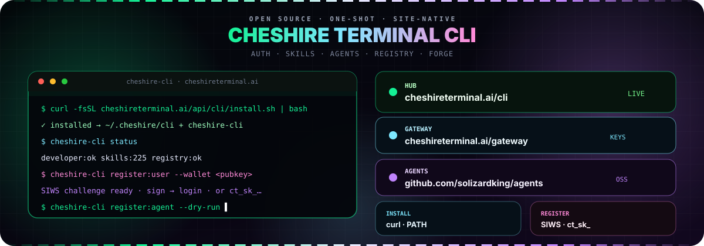

<p align="center">
  <a href="https://cheshireterminal.ai/cli">
    
  </a>
</p>

# Cheshire Terminal CLI

<p align="center">
  <strong>Open-source CLI for Cheshire Terminal</strong><br/>
  Public install · optional SIWS / API keys · skills · eliza agents · agent registry · arena · forge prepare<br/>
  Default origin: <code>https://cheshireterminal.ai</code>
</p>

<p align="center">
  <a href="https://cheshireterminal.ai/cli"></a>
  <a href="https://cheshireterminal.ai/eliza-agents"></a>
  <a href="https://cheshireterminal.ai/agents"></a>
  <a href="https://cheshireterminal.ai/agents/forge"></a>
  <a href="https://github.com/Solizardking/cli"></a>
  <a href="https://www.npmjs.com/package/cheshire-terminal-cli"></a>
</p>

<p align="center">
  
  
  
  
</p>

---

## What this is

**Cheshire Terminal CLI** (`cheshire-terminal-cli` on npm) is the official command-line client for the public [Cheshire Terminal](https://cheshireterminal.ai) APIs.

| You want… | You run… |
|-----------|----------|
| **Ink interactive shell** | `cheshire-cli` (TTY) or `cheshire-cli tui` |
| Live site health | `cheshire-cli status` |
| Skills catalog | `cheshire-cli skills` |
| Eliza agents studio | `cheshire-cli eliza:status` · `eliza:generate` · `eliza:deploy` |
| Wallet sign-in challenge | `cheshire-cli register:user --wallet <pubkey>` |
| Mint developer key (in-terminal) | `cheshire-cli keys:create --name "laptop"` |
| Store developer key | `cheshire-cli set-key --api-key ct_sk_…` |
| Prepare agent registry JSON | `cheshire-cli register:agent --dry-run` |
| Publish agent (rate-limited) | `cheshire-cli register:agent --confirm --name my-slug` |
| Dual-rail forge hints | `cheshire-cli forge:prepare` |
| Arena rooms / host agent | `cheshire-cli arena:rooms` · `arena:register` |
| **Agentic wallet** (local, Kit RPC) | `cheshire-cli wallet:status` · `wallet:create` · `wallet:balance` |
| Dual CLI mesh probe | `cheshire-cli wallet:hubs` |

**Hub:** [cheshireterminal.ai/cli](https://cheshireterminal.ai/cli)  
**Companion hub:** [solanaclawd.com/cli](https://solanaclawd.com/cli)  
**Eliza studio:** [cheshireterminal.ai/eliza-agents](https://cheshireterminal.ai/eliza-agents)  
**Agents hub:** [cheshireterminal.ai/agents](https://cheshireterminal.ai/agents)  

### Dual-host mesh + agentic wallet

Both sites expose `/cli` and `/api/cli`:

| Host | Install | Role |
|------|---------|------|
| **cheshireterminal.ai** | `curl -fsSL https://cheshireterminal.ai/api/cli/install.sh \| bash` | Primary product CLI |
| **solanaclawd.com** | `curl -fsSL https://solanaclawd.com/api/cli/install.sh \| bash` | openclawd / solana-clawd companion |

```bash
export CHESHIRE_SITE_URL=https://cheshireterminal.ai
export SOLANA_CLAWD_SITE_URL=https://solanaclawd.com

cheshire-cli wallet:status          # vault + probe both /api/cli hubs
cheshire-cli wallet:create --pass 'strong-pass'
cheshire-cli wallet:balance
cheshire-cli wallet:policy --type transfer_sol --to <addr> --lamports 1000000
clawd-cli wallet                    # alias → wallet:status
```

Agentic wallet package: `@x402solana/cheshire-agentic-wallet` (Chrome extension + mobile PWA + local vault under `~/.cheshire/agentic-wallet/`).

### Open-source companion repos

| Repo | Role | Site hub |
|------|------|----------|
| **[Solizardking/cli](https://github.com/Solizardking/cli)** (this package) | Official site CLI | [/cli](https://cheshireterminal.ai/cli) |
| **[Solizardking/agents](https://github.com/Solizardking/agents)** | Agent catalog + forge scaffolds | [/agents](https://cheshireterminal.ai/agents) |
| **[Solizardking/eliza](https://github.com/Solizardking/eliza)** | elizaOS fork + `@elizaos/cheshire-eliza` | [/eliza-agents](https://cheshireterminal.ai/eliza-agents) |
| **[Solizardking/cheshire-terminal](https://github.com/Solizardking/cheshire-terminal)** | Main product app | [cheshireterminal.ai](https://cheshireterminal.ai) |

**Optional forge package:** [`cheshire-terminal-agents`](https://www.npmjs.com/package/cheshire-terminal-agents)

```mermaid
flowchart LR
  U[You] -->|npm or curl install| C[cheshire-cli]
  C -->|GET status / skills / agents| S[cheshireterminal.ai]
  C -->|eliza:*| E[/api/eliza-agents/*]
  E --> ES[Eliza studio /eliza-agents]
  C -->|optional SIWS| A[/api/auth/*]
  C -->|dry-run or confirm| R[/api/agent-registry/register]
  C -.->|forge prepare| F[cheshire-terminal-agents]
  F --> HUB[Agent Hub / Forge]
  S --> HUB
  S --> ES
```

This package does **not** custody private keys. Clone it, install it, and call the public site over HTTPS — no private product tree required.

---

## Install

### npm (recommended)

```bash
npm i -g cheshire-terminal-cli
# or one-shot without global install:
npx cheshire-terminal-cli help
```

### Public curl installer

```bash
curl -fsSL https://cheshireterminal.ai/api/cli/install.sh | bash
export PATH="$HOME/.local/bin:$PATH"
# or: source ~/.cheshire/cli-env.sh

cheshire-cli help
cheshire-cli status
cheshire-cli tui          # Ink React terminal shell
```

### Interactive Ink TUI

The CLI ships an **[Ink](https://github.com/vadimdemedes/ink)** (React) shell for interactive use:

```bash
cheshire-cli              # bare launch on a TTY
cheshire-cli tui          # force Ink shell
cheshire-cli --ink-smoke  # CI mount smoke
```

Type commands at the `›` prompt (`status`, `skills`, `connect`, `help`, `exit`). Non-interactive scripts keep using subcommands that print JSON/text without Ink.

### From this repository

```bash
git clone https://github.com/Solizardking/cli.git
cd cli
chmod +x cheshire-cli.sh clawd-cli.sh clawd-connect.sh
./cheshire-cli.sh help
./cheshire-cli.sh status
npm test
```

Compat wrappers use the same engine:

```bash
./clawd-cli.sh status
./clawd-connect.sh skills:list
node cheshire-register.mjs          # register:agent --dry-run
```

---

## Environment

| Variable | Default | Purpose |
|----------|---------|---------|
| `CHESHIRE_SITE_URL` | `https://cheshireterminal.ai` | Site origin (no trailing slash) |
| `CHESHIRE_API_KEY` | — | Optional developer key `ct_sk_…` (`Authorization` + `x-api-key`) |
| `CHESHIRE_CREDENTIALS_PATH` | `~/.config/cheshire-terminal/credentials.json` | Optional credentials file |

```bash
export CHESHIRE_SITE_URL=https://cheshireterminal.ai
export CHESHIRE_API_KEY=ct_sk_…   # optional — only when you have a developer key
```

Never commit real keys. Never paste Solana private keys or seed phrases into the CLI. SIWS signing stays in your wallet; the CLI only carries the public challenge and the signature you supply.

---

## Command map

### Discovery

```bash
cheshire-cli help
cheshire-cli status          # developer + skills + agent-registry + metaplex health
cheshire-cli skills          # GET /api/skills
cheshire-cli skills:search solana
cheshire-cli agents          # catalog summary + registry
cheshire-cli registry        # GET /api/agent-registry/status
cheshire-cli connect         # endpoint map
cheshire-cli sync            # skills + agents + registry snapshot
```

### User registration / auth

```bash
# 1) Fetch SIWS challenge (no private key required for this step)
cheshire-cli register:user --wallet <YOUR_SOLANA_PUBKEY>

# 2a) Sign challenge.message (ed25519 detached, base58), then verify
cheshire-cli login \
  --wallet <pubkey> \
  --signature <sig> \
  --message '<exact challenge message>'

# 2b) Mint a developer API key entirely in-terminal (requires signed-in principal
#     from step 2a, or an existing CHESHIRE_API_KEY / --api-key for bootstrap)
cheshire-cli keys:create --name "laptop"
cheshire-cli keys:list
# keys:create prints the secret once — store it:
cheshire-cli set-key --api-key ct_sk_…
cheshire-cli whoami

# 2c) Or paste a key you created on the dashboard
cheshire-cli set-key --api-key ct_sk_…
```

### Agent registration

```bash
cheshire-cli register:agent --dry-run
cheshire-cli register:agent --dry-run --name my-agent-slug --file cheshire-registration.json
cheshire-cli register:agent --confirm --name my-agent-slug
cheshire-cli forge:prepare --file cheshire-registration.json
```

### Eliza agents studio (`@elizaos/cheshire-eliza`)

Same surface as the web studio at [/eliza-agents](https://cheshireterminal.ai/eliza-agents):

```bash
cheshire-cli eliza:status                         # package + plugins + cloud readiness
cheshire-cli eliza:catalog                        # character seeds (Solizard first)
cheshire-cli eliza:package                        # plugin bundle + ActionPlan examples
cheshire-cli eliza:solizard                       # full Solizard package character JSON
cheshire-cli eliza:generate --name ClawdScout --archetype trader \
  --rails solana,robinhood --seed solizard
cheshire-cli eliza:deploy --name ClawdScout --archetype trader --seed solizard
```

Optional flags on generate/deploy: `--no-e2b`, `--no-memory`, `--no-forge`, `--browser-use`, `--system-extra "…"`.

### Agent Arena

```bash
cheshire-cli arena:status
cheshire-cli arena:rooms
cheshire-cli arena:list --hosted
cheshire-cli arena:register --name my-bot --model kimi-k3 --confirm --host
cheshire-cli arena:enter --id arena_ag_… --room room_…
```

### Full table

| Command | What it does |
|---------|----------------|
| `help` | Usage |
| `status` | `GET /api/developer/status` + skills + registry + metaplex health |
| `skills` / `skills:search <q>` | Skills catalog |
| `agents` | Catalog summary + registry health |
| `registry` | Agent-registry proxy status |
| `connect` | Site endpoint map |
| `sync` | Skills + agents + registry snapshot |
| `eliza` / `eliza:status` | `GET /api/eliza-agents/status` |
| `eliza:catalog` | Character seeds catalog |
| `eliza:package` | Plugin bundle + multi-step ActionPlan examples |
| `eliza:solizard` | Full Solizard package character |
| `eliza:generate --name` | `POST /api/eliza-agents/generate` body JSON |
| `eliza:deploy --name` | `POST /api/eliza-agents/deploy` plan + character |
| `register:user --wallet` | `GET /api/auth/challenge?wallet=` |
| `login --wallet --signature --message` | `POST /api/auth/verify` |
| `whoami` | Credential source + principal |
| `set-key --api-key ct_sk_…` | Persist key (mode `0600`) |
| `keys:create --name` | `POST /api/developer/keys` (holder principal) |
| `keys:list` | `GET /api/developer/keys` |
| `keys:revoke --id` | `DELETE /api/developer/keys/:id` |
| `register:agent --dry-run` | Build register body (no write) |
| `register:agent --confirm` | `POST /api/agent-registry/register` |
| `forge:prepare` | Hints for optional `cheshire-terminal-agents` |
| `arena:*` | Rooms, register, host, enter on `/arena` |

Common flags: `--site <url>`, `--api-key <key>`, `--file <reg.json>`, `--name <slug>`, `--confirm`, `--dry-run`.

Most commands print **JSON**. `help` prints text.

---

## Public site APIs

| Surface | Method · path |
|---------|----------------|
| CLI hub UI | [cheshireterminal.ai/cli](https://cheshireterminal.ai/cli) |
| CLI product API | `GET /api/cli` · `GET /api/cli/status` · `GET /api/cli/install.sh` |
| Developer status | `GET /api/developer/status` |
| Skills | `GET /api/skills` |
| SIWS challenge | `GET /api/auth/challenge?wallet=` |
| SIWS verify | `POST /api/auth/verify` |
| Agent registry | `GET /api/agent-registry/status` · `POST /api/agent-registry/register` |
| Metaplex health | `GET /api/metaplex-agents/health` |
| Browser agents | `GET /api/clawd/browser-agents` |
| Eliza studio UI | [cheshireterminal.ai/eliza-agents](https://cheshireterminal.ai/eliza-agents) |
| Eliza agents API | `GET /api/eliza-agents/status` · catalog · package · solizard · `POST` generate · deploy |
| Arena | `GET /api/arena/status` · rooms · agents |

Some remote routes may require a developer key or session depending on site policy. The CLI accepts optional credentials; it does not hard-code premium product funnels.

---

## Registration fixtures

Example JSON shipped with the package (all services host on **cheshireterminal.ai**):

| File | Role |
|------|------|
| `cheshire-registration.json` | Primary Cheshire product registration |
| `cheshire-config.json` | CLI defaults + empty `CHESHIRE_API_KEY` |
| `clawd-registration.json` | Compat name (Cheshire-branded) |
| `clawd-openclaw-config.json` | Compat config (Cheshire-branded) |
| `solana-clawd-registration.json` | Short identity services list |

---

## Dual-rail forge (optional peer)

Identity forge work lives in the separate npm package **[cheshire-terminal-agents](https://www.npmjs.com/package/cheshire-terminal-agents)**:

```bash
export CHESHIRE_SITE_URL=https://cheshireterminal.ai
# optional:
export CHESHIRE_API_KEY=ct_sk_…

npx cheshire-terminal-agents agents-list
npx cheshire-terminal-agents capabilities --site https://cheshireterminal.ai
npx cheshire-terminal-agents prepare-local-robinhood \
  --file cheshire-registration.json --chain 46630
```

- Agents catalog OSS: [github.com/solizardking/agents](https://github.com/solizardking/agents)  
- Hosted hub: [cheshireterminal.ai/agents](https://cheshireterminal.ai/agents)  
- Forge UI: [cheshireterminal.ai/agents/forge](https://cheshireterminal.ai/agents/forge)

> [!IMPORTANT]
> Live mint / broadcast / mainnet writes stay **fail-closed**. Prefer `--dry-run` / prepare. Never paste private keys into the CLI. Wallet signing stays in your wallet.

---

## Layout

```
.
├── assets/
│   └── cheshire-terminal-cli.svg
├── bin/cheshire-cli.js             # npm bin entry
├── cheshire-cli.mjs                # node entry
├── cheshire-cli.sh                 # shell entry
├── cheshire-register.mjs
├── clawd-cli.sh                    # compat → cheshire-cli
├── clawd-connect.sh
├── src/
│   ├── config.mjs
│   ├── client.mjs
│   ├── catalog.mjs
│   ├── commands.mjs
│   └── index.mjs
├── cheshire-cli.test.mjs
├── arena-register.test.mjs
├── cheshire-registration.json
├── cheshire-config.json
├── package.json
├── LICENSE
└── README.md
```

---

## Tests

```bash
npm test
# equivalent:
node --test ./cheshire-cli.test.mjs ./arena-register.test.mjs
```

Tests drive the **shipped** modules: help branding, default site URL, open-source wording, SIWS challenge against the live site (when network allows), agent dry-run payload, and registration JSON host checks.

---

## Quick links

| | |
|--|--|
| **This repo** | [github.com/Solizardking/cli](https://github.com/Solizardking/cli) |
| **CLI hub** | [cheshireterminal.ai/cli](https://cheshireterminal.ai/cli) |
| **Install** | `npm i -g cheshire-terminal-cli` or `curl -fsSL https://cheshireterminal.ai/api/cli/install.sh \| bash` |
| **Agents (GitHub)** | [github.com/solizardking/agents](https://github.com/solizardking/agents) |
| **Agent hub** | [cheshireterminal.ai/agents](https://cheshireterminal.ai/agents) |
| **Agent forge** | [cheshireterminal.ai/agents/forge](https://cheshireterminal.ai/agents/forge) |
| **Forge npm** | [cheshire-terminal-agents](https://www.npmjs.com/package/cheshire-terminal-agents) |
| **API docs** | [cheshireterminal.ai/api-docs](https://cheshireterminal.ai/api-docs) |
| **Developer status** | [cheshireterminal.ai/api/developer/status](https://cheshireterminal.ai/api/developer/status) |

---

## License

MIT — see [LICENSE](./LICENSE).

<p align="center">
  <sub>
    <a href="https://cheshireterminal.ai/cli">cheshireterminal.ai/cli</a>
    ·
    <a href="https://github.com/Solizardking/cli">github.com/Solizardking/cli</a>
    ·
    <code>export CHESHIRE_SITE_URL=https://cheshireterminal.ai</code>
  </sub>
</p>
